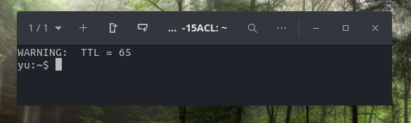

# ttl_65

Script for auto-recognized value TTL
and if his equil 64, then set 65

> Fragment from `/etc/bash.bashrc`
``` bash
string=`ping -c 1 127.0.0.1 | grep ttl`

if [[ $string == *"64 bytes from 127.0.0.1: icmp_seq=1 ttl=64"* ]]; then
  echo "WARNING:  TTL = 64"
  echo "Password for set value 65" 
  sudo sysctl net.ipv4.ip_default_ttl=65
fi

if [[ $string == *"64 bytes from 127.0.0.1: icmp_seq=1 ttl=65"* ]]; then
  echo "WARNING:  TTL = 65"
fi
```
***


> Demo screen
> 
first launch console/terminal/tmux/other..


second and other launch
